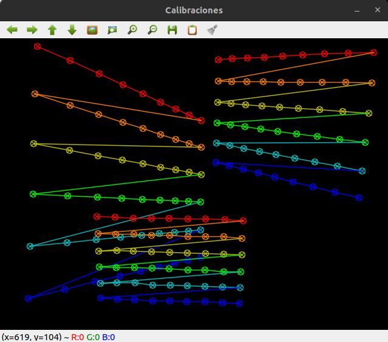

# Calibración de cámara

[Documentación en Github Pages](https://laboratorio-de-robotica.github.io/Calibrador-de-camara/)

## calibrate.py
Aplicación de calibración interactiva, en Python, para ejecutar en PC.

Comandos:

* space: grab a picture
* c: calibrates with grabbed pictures
* ESC: quit

Los resultados se muestran en consola.

