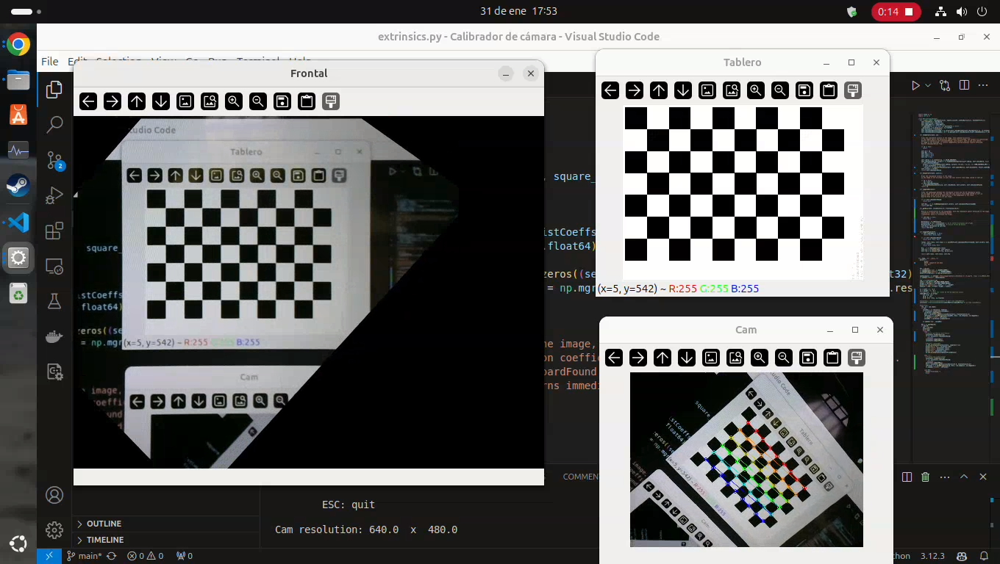

# Calibración extrínseca

El documento [Calibración extrínseca y homografía](https://docs.google.com/document/d/1nhmtYOhzDWaSmLdVwkBU2KdvJJxvtFabnacuMqiCFtQ/edit?tab=t.0) describe los fundamentos de la calibración extrínseca y la determinación de homografía, así como las bases del programa `extrinsics.py` 

# extrinsics.py

`extrinsics.py` se puede usar como biblioteca que provee la clase `ExtrinsicCalibrator` que se documenta más abajo, o direcamente para una demo con la webcam:

La imagen muestra una captura de pantalla de VSC ejecutando la demo de `extrinsic.py`.  Tiene tres ventanas principales:

- Tablero: patrón ajedrez, imagen estática (arriba a la derecha)
- Cam: vista en vivo de la cámara
- Frontal: produce una vista frontal, invariante a la pose de la cámara

La vista frontal demuestra que el sistema puede calcular coordenadas del mundo real, compensando la perspectiva de la cámara.

Este video de [extrinsics.py](https://drive.google.com/file/d/1JAagQMls_ECDpgrcRLa8eqzPiderIHhm/view?usp=drive_link) muestra cómo convierte a coordenadas del mundo en tiempo real con la cámara en moviemiento.

## ExtrinsicCalibrator
Esta clase toma los datos de configuración en la construcción, y presenta métodos para obtener homografía y pose sobre la imagen proporcionada.

Cuando se pasa una imagen en los métodos getPose o getHomography, la imagen se registra y se procesa para detectar las esquinas del patrón.  Cuando no se pasa nada se usa la imagen anterior.

### Constructor
Todos los argumentos son de configuración y opcionales:
- chessBoard=(9,6), formato del patrón
- square_size=25, tamaño real del casillero del tablero
- cameraMatrix=None
- distCoeffs=None

Si se proporcionan los parámetros de cámara, la detección de esquinas del patrón ajedrez antidistorsiona las coordenadas.

Si no se proporcionan, no se puede usar getPose().

### findCorners(im)
Procesa la imagen argumento.
Produce self.chessboardFound, self.corners, self.im and self.imGray.
self.corners es usado por otros métodos.
Devuelve chessboardFound.

### drawCorners(im)
Anota las esquinas encontradas con findCorners sobre la imagen im.
Devuelve im anotada.

### computeHwc()
Computa al homografía Hwc que convierte coordenadas de la imagen en píxeles a coordenadas del mundo en la unidad elegida para square_size.
Requiere haber procesado la imagen con findCorners().
Devuelve la homografía self.Hwc .

### getHviz()
Calcula la homografía para visualización, para ser usada con cv.warpPerspective().
Requiere haber computado Hwc.

### computePose()
Computa la pose del patrón, y la devuelve en tres argumentos:
- tvec
- rvec
- Twc

Requiere haber procesado la imagen con findCorners().
