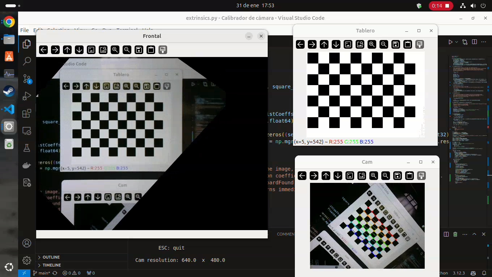

# Calibración extrínseca

El documento [Calibración extrínseca y homografía](https://docs.google.com/document/d/1nhmtYOhzDWaSmLdVwkBU2KdvJJxvtFabnacuMqiCFtQ/edit?tab=t.0) describe los fundamentos de la calibración extrínseca y la determinación de homografía, así como las bases del módulo `extrinsics.py` 

El proyecto [Picking-U2Net](https://laboratorio-de-robotica.github.io/Picking-U2Net/) implementa este módulo.

`extrinsics.py` se puede usar como biblioteca que provee la clase `ExtrinsicCalibrator` importándose de esta manera:

    from extrinsics import ExtrinsicCalibrator

o direcamente para una demo con la webcam:

La imagen muestra una captura de pantalla de VSC ejecutando la demo de `extrinsic.py`.  Tiene tres ventanas principales:

- Tablero: patrón ajedrez, imagen estática (arriba a la derecha)
- Cam: vista en vivo de la cámara
- Frontal: produce una vista frontal, invariante a la pose de la cámara

La vista frontal demuestra que el sistema puede calcular coordenadas del mundo real, compensando la perspectiva de la cámara.

Este video de [extrinsics.py](https://drive.google.com/file/d/1JAagQMls_ECDpgrcRLa8eqzPiderIHhm/view?usp=drive_link) muestra cómo convierte a coordenadas del mundo en tiempo real con la cámara en moviemiento.