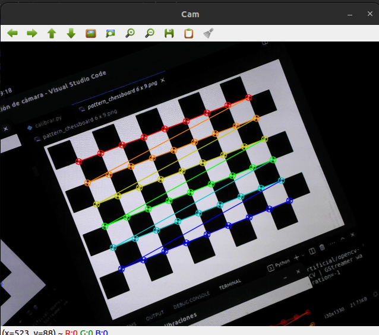
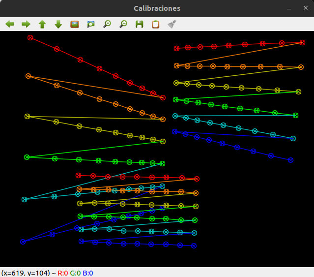

# Calibrador de cámara

[Calibración extrínseca](./extrinsics.md)

Calibrador de cámara interactivo, en Python, que obtiene la matriz intrínseca y los coeficientes de distorsión.  Para cámaras comunes (estenopéicas, no de gran angular).

Usa el patrón chessboard 9x6:

Se pueden usar otros tamaños de este patrón cambiando la línea:

    chessBoard = (9,6)

Para usar el patrón de bolitas o charuco hay que modificar el código.

# Instalación

Código Python, requiere OpenCV.

    pip install numpy opencv-contrib
    git clone 

El programa muestra tres ventanas:

- Cam: la vista de la cámara en vivo
- Tablero: patrón de calibración
- Detecciones: anotaciones superpuestas que dan idea de la cobertura de la imagen que lograron las capturas realizadas

El proceso de calibración consiste en tomar varias fotos del patrón de calibración, que puede estar impreso en una hoja de papel, o bien mostrarse en una pantalla (monitor o celular).  Es muy importante que el patrón sea plano, no sirven hojas combadas ni monitores curvos.

El tablero se muestra en pantalla por conveniencia, sirve para calibrar una webcam usb (una cámara que pueda observar la propia pantalla).  

Esta aplicación está escrita en Python y no se puede ejecutar en un celular (al menos no de manera sencilla).  Se puede calibrar la cámara de un celular con alguna aplicación que la convierta en webcam inalámbrica de la PC.

Para calibrar la cámara de una notebook, que no puede observar su propia pantalla, se puede usar un patrón impreso o mostrado en la pantalla de un celular.  El patrón se muestra al inicio de esta misma página, y la imagen se puede copiar de 

    /docs/images/pattern_chessboard 6 x 9.png

# Comandos
Éstos son las teclas para comandos que el usuario envía durante la ejecución:

- **espacio**, registra el patrón detectado y lo agrega a la ventana Detecciones
- **c**, calibra con todos los patrones registrados, y muestra el resultado en consola
- **ESC**, termina

El programa no termina luego de calibrar, el usuario puede seguir registrando patrones y repetir la calibración: los patrones registrados con anterioridad no se borran.

# Calibración
Una buena calibración usa entre 40 y 60 fotos.  Se puede reducir a cerca de 20 si se buscan las poses adecuadas:

El documento [Calibración de cámara en Python](https://docs.google.com/document/d/1mIRz3X5iICOr7jhdFvvJbPFms467_l0ha0ozVbz4bts/edit?usp=sharing) describe el desarrollo de este programa.  Bajo el título **Efficient pose** se muestras las mejores poses del patrón para una calibración eficiente.

Para profundizar en el tema se recomiendan las referencias al final de ese documento, y [el tutorial de OpenCV](https://docs.opencv.org/4.x/d4/d94/tutorial_camera_calibration.html)

